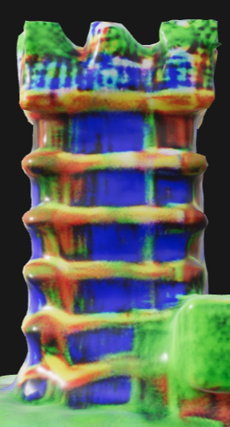
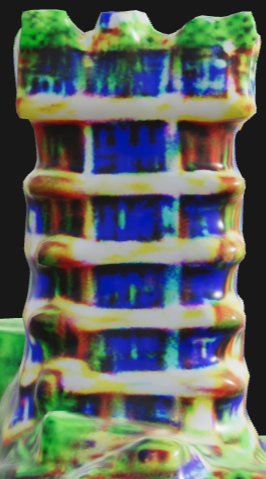
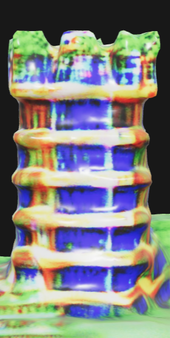
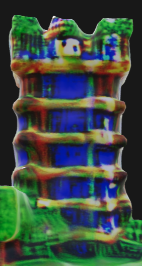

# Arrow Tower Instruction

## Text

- **Building:** A simple solid arrow tower similar to the tower in the images. The arrow tower has an external ladder to the top of the tower.
- **Building Suggestions:** You should build the arrow tower by stacking layer by layer. The whole ladder and tower must be above the ground plane. Do not generate multiple subcomponents representing the ladder, you should merge these subcomponents into one subcomponent.
- **Functional Requirements:** I can climb to the top of the tower through the ladder externally. The arrow tower must be higher than the column in the Minecraft Game I gave.
- **Key Design Parameters:** The height of the arrow tower. The height of the arrow tower depends on the height of the column. If the arrow tower is not higher than the column, try increasing the height of the arrow tower.

## Multi-view Images

