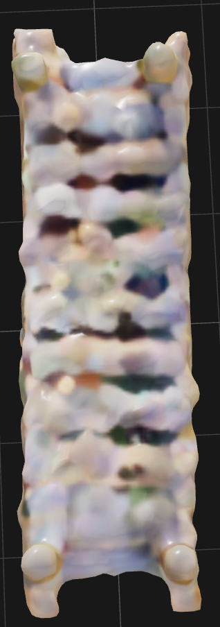
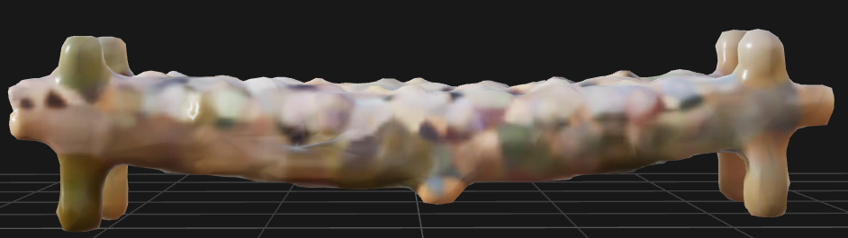
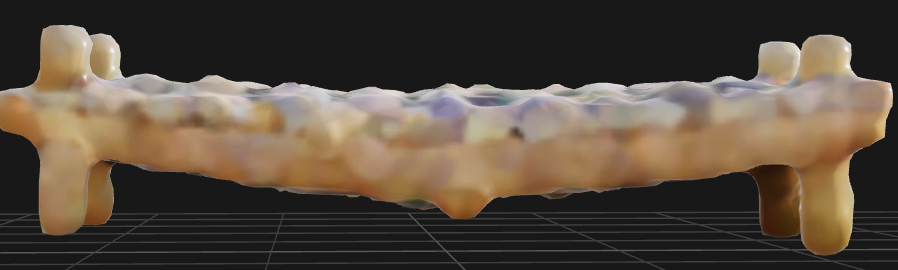
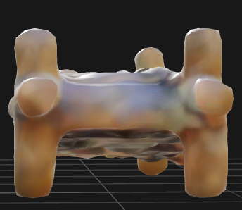
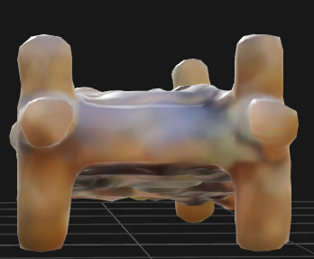

# Bridge Instruction

## Text

- **Building:** A simple east-west plank bridge similar to the bridge in images.
- **Building Suggestions:** Do not create any subcomponents representing the bridge's support and omit unnecessary decorative subcomponents and elements. Assume the water surface of the river is the level of the ground.
- **Functional Requirements:** The bridge should connect the east and west banks of the river for players to cross.
- **Key Design Parameters:** The length of the bridge. The length of the bridge depends on the width of the river, if the bridge cannot span the river, try increasing the length of the bridge.

## Multi-view Images

