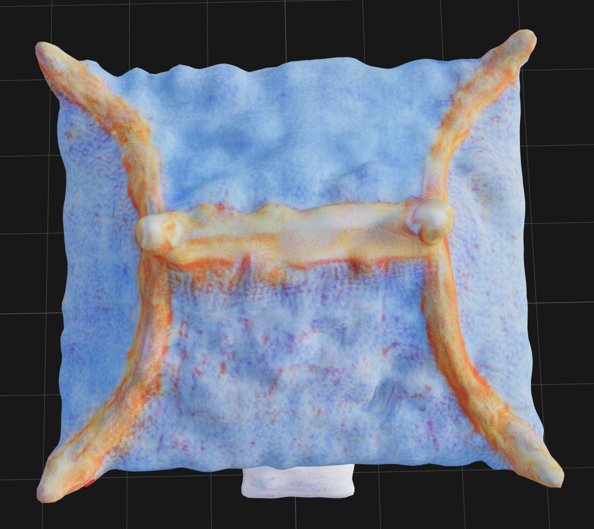
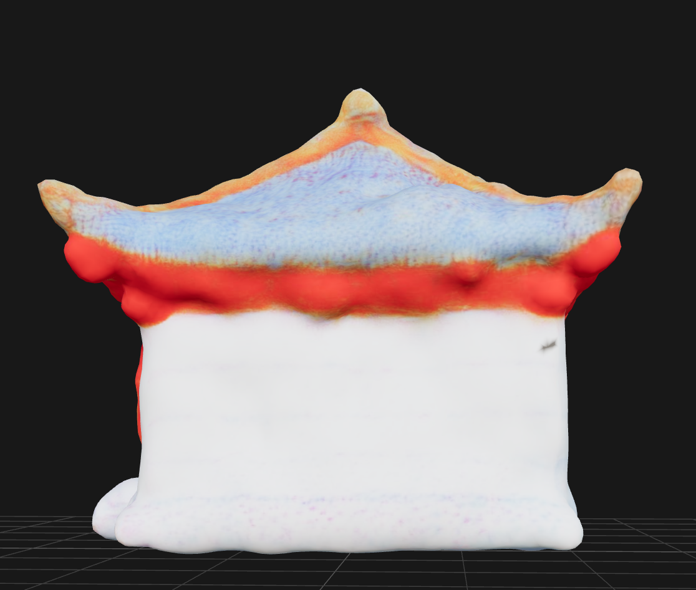
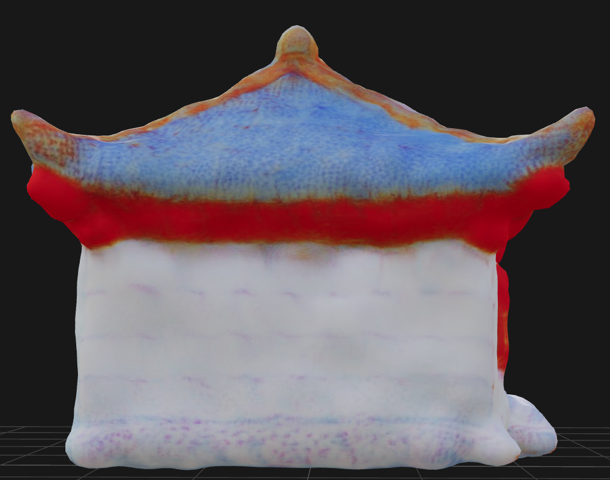
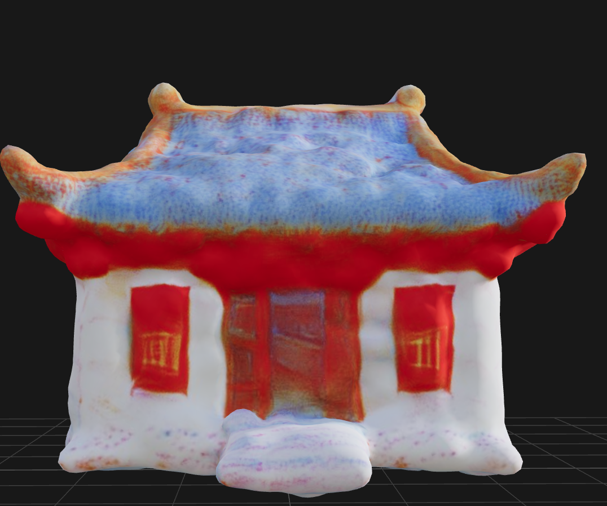
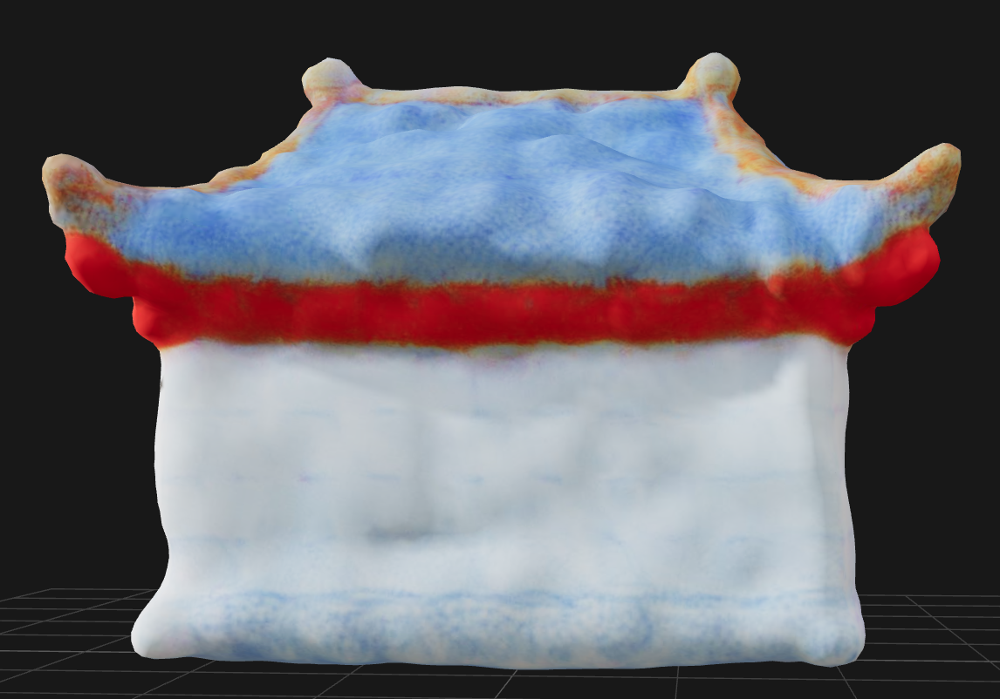

# Chinese Ancient House Instruction

## Text

- **Building:** A simple Chinese ancient house similar to the house in the images.
- **Building Suggestions:** Do not create any subcomponents representing the house's foundation or interior floor. The house should not be larger than 10x10 blocks.
- **Functional Requirements:** This house should have a door through which the player can enter the interior of the house.
- **Key Design Parameters:** The size and position of the door. If the player cannot enter the house, try adjusting the size and position of the door.

## Multi-view Images

