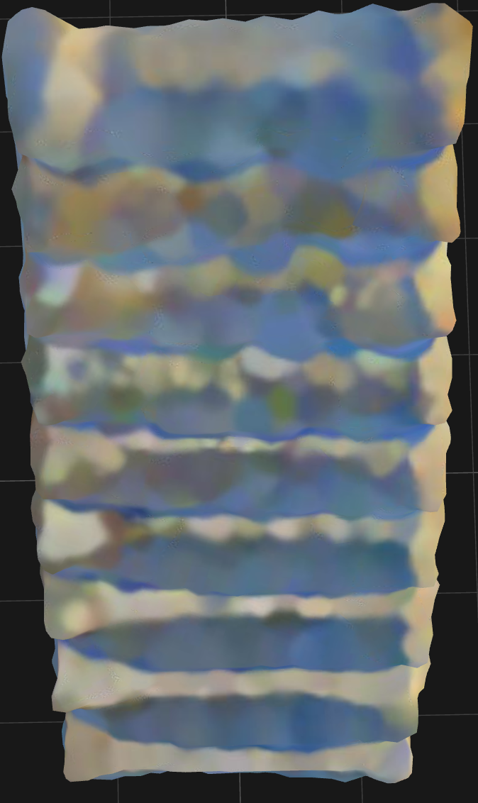
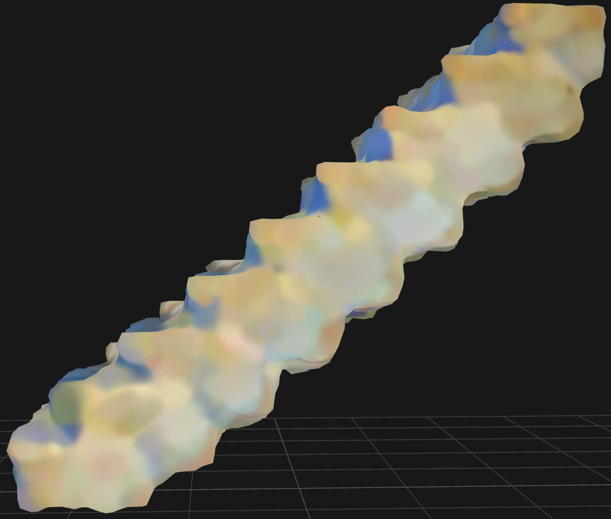
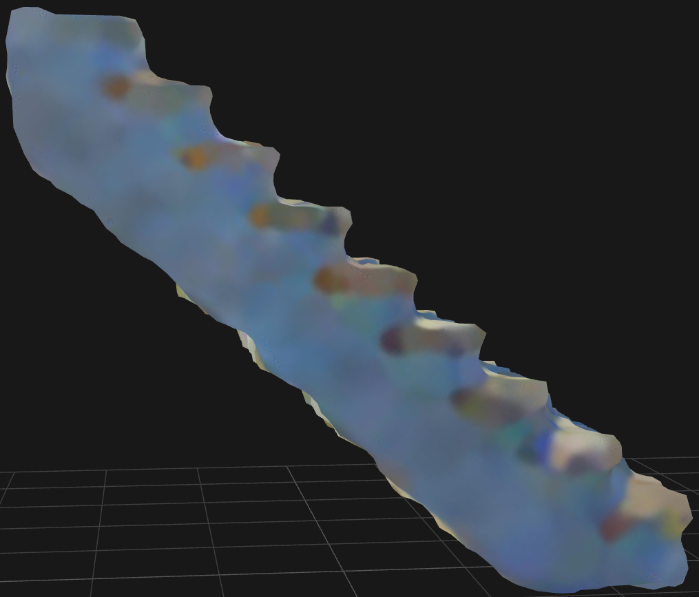
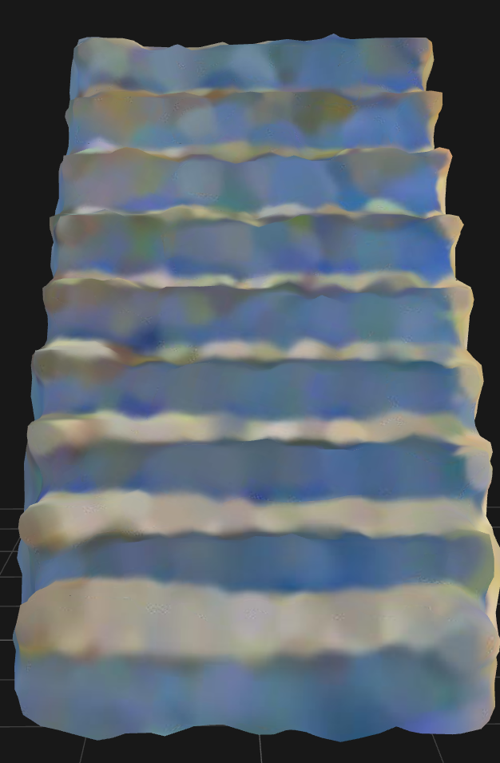
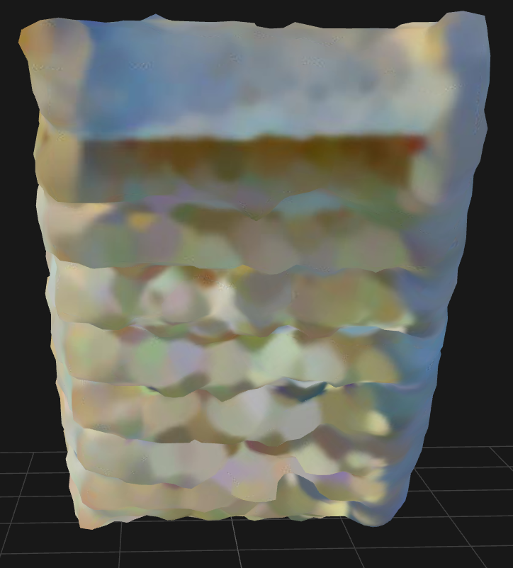

# Stair Instruction

## Text

- **Building:** A simple stair similar to the stairs in the images.

- **Building Suggestions:** You can build it layer by layer.

- **Functional Requirements:** The stairs should be high enough for players to climb the cliff.
- **Key Design Parameters:** The height of the stairs. The height of the stairs depends on the height of the cliff. If the stair cannot help the players climb the cliff, try increasing the height of the stair.

## Multi-view Images

