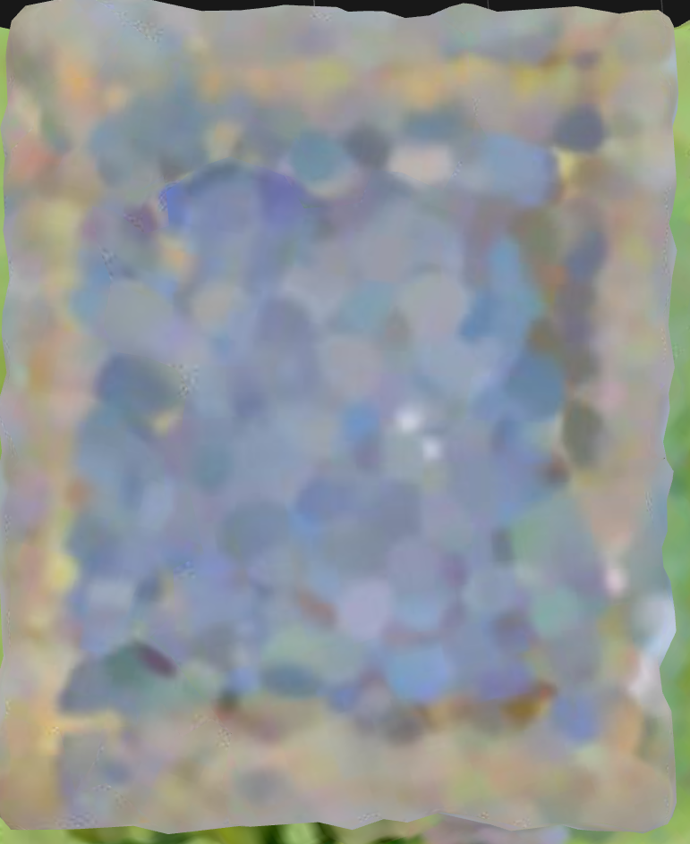

# Two Story House Instruction

## Text

- **Building:** A simple two story house (the ground floor and the first floor) with flat roof similar to the house in images.

- **Building Suggestions:** Do not create any subcomponents representing the house's foundation or interior floor. The house should not be larger than (wide x length) 10x10 blocks.

- **Functional Requirements:** This house should have a door through which the player can enter interior of the house's ground floor.
- **Key Design Parameters:** The size and position of the door. If the player cannot enter interior of the house's ground floor, try adjusting the size and position of the door.

## Multi-view Images

